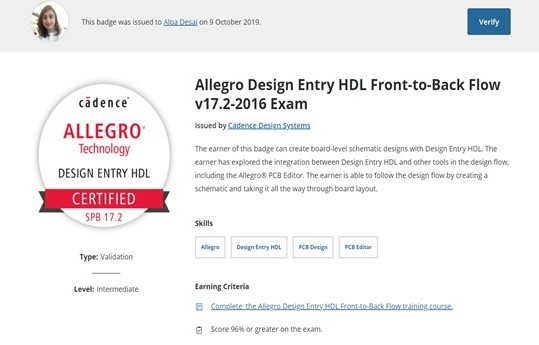

# Coding Firmware For Xilinx

The project provides introduction to coding algorithms focused on firmware for Xilinx FPGAs.
All images are custom by Alpa D. Desai or have references

## Applications of Firmware

## Applications of firmware focused on high speed designs

