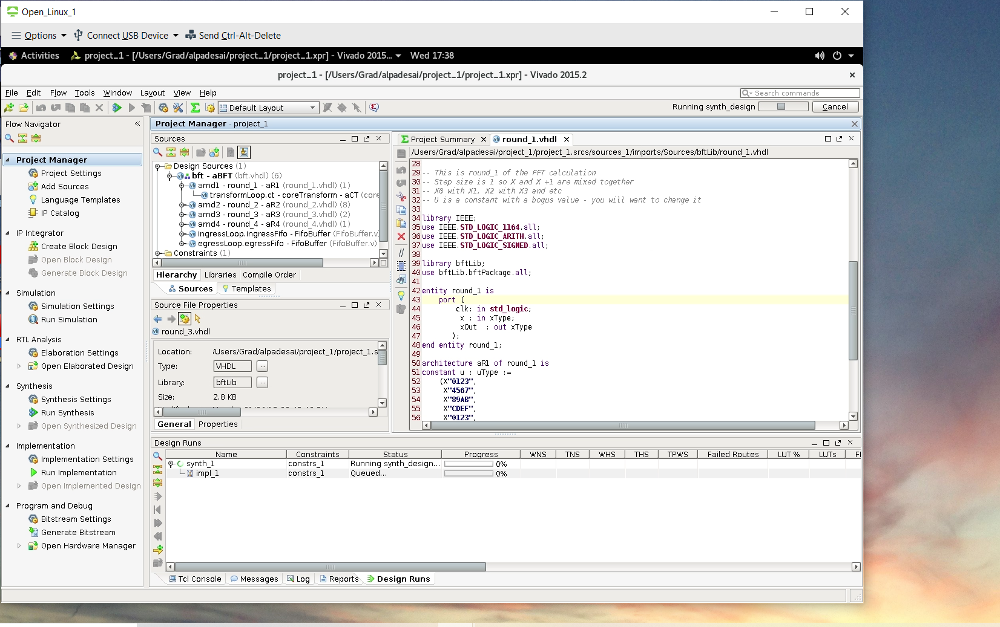

# Coding Firmware For Xilinx

The project provides introduction to coding algorithms focused on firmware for Xilinx FPGAs.
All images are custom by Alpa D. Desai or have references

Please reference the https://github.com/alpaddesai/CodingFirmwareForXilinx/releases for details

## Verilog

## FPGA 

### Access to Xilinx Vivado

Additional details : https://github.com/alpaddesai/DigitalLogicHDL
