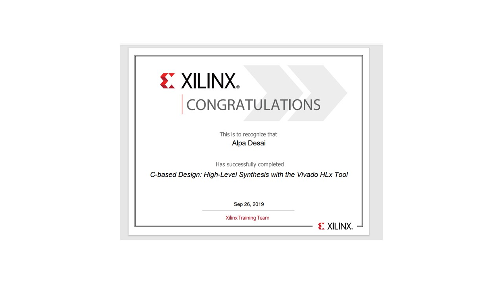
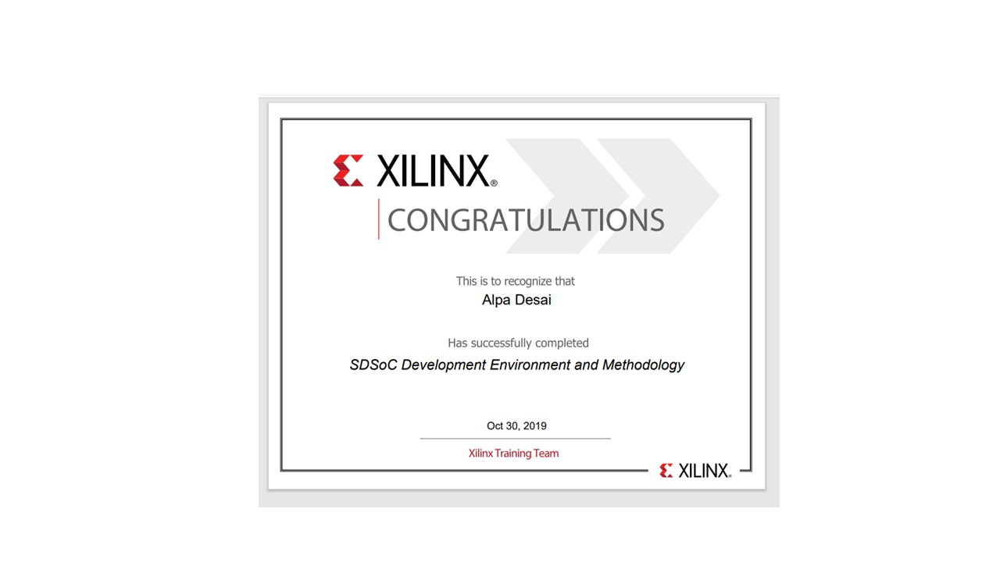

# Embedded Design

The project provides introduction embedded design
All images are custom by Alpa D. Desai or have references

## Verilog

## FPGA 

## C Based HLA

## SDSOC

## Embedded Design on processor

Additional details : https://github.com/alpaddesai/DigitalLogicHDL and https://github.com/alpaddesai/ComputerArchitecture 
