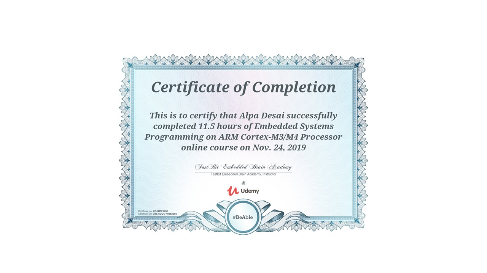
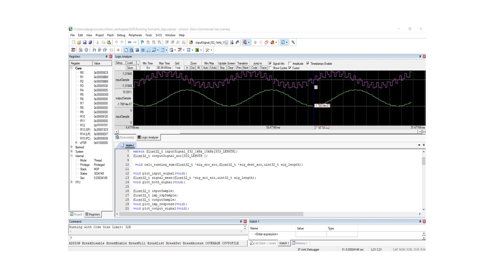
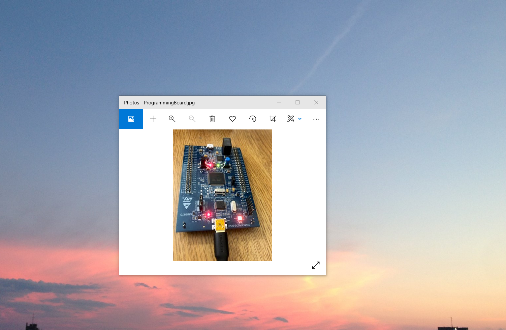

# Embedded Design

The project provides introduction embedded design
All images are custom by Alpa D. Desai or have references

## FPGA 

## Embedded Design on processor

## ARM Ground Up
#### incomplete - UART port

## ARM Ground Up
#### incomplete - oscilloscope, wiring.

## Digital Signal Processing

## Programming Board

## Ethics and Integrity

Additional details : https://github.com/alpaddesai/DigitalLogicHDL and https://github.com/alpaddesai/ComputerArchitecture 
